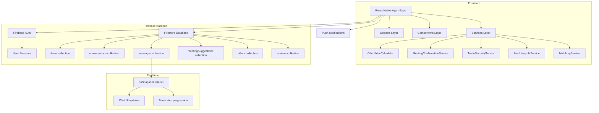
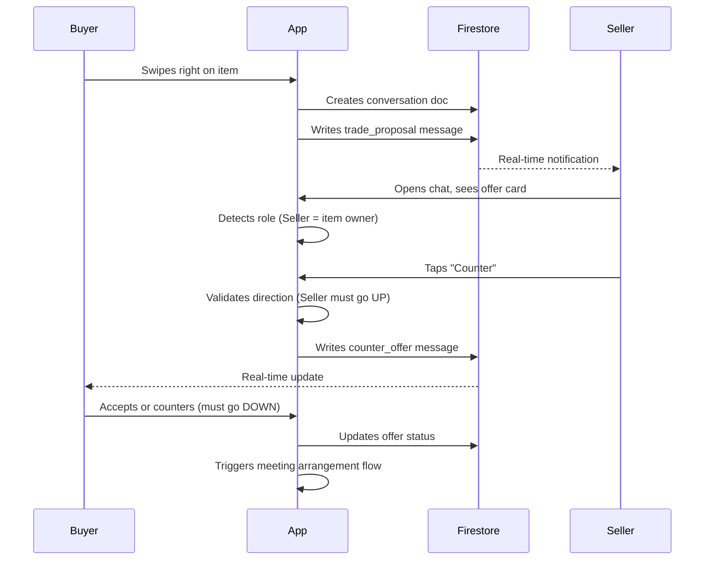
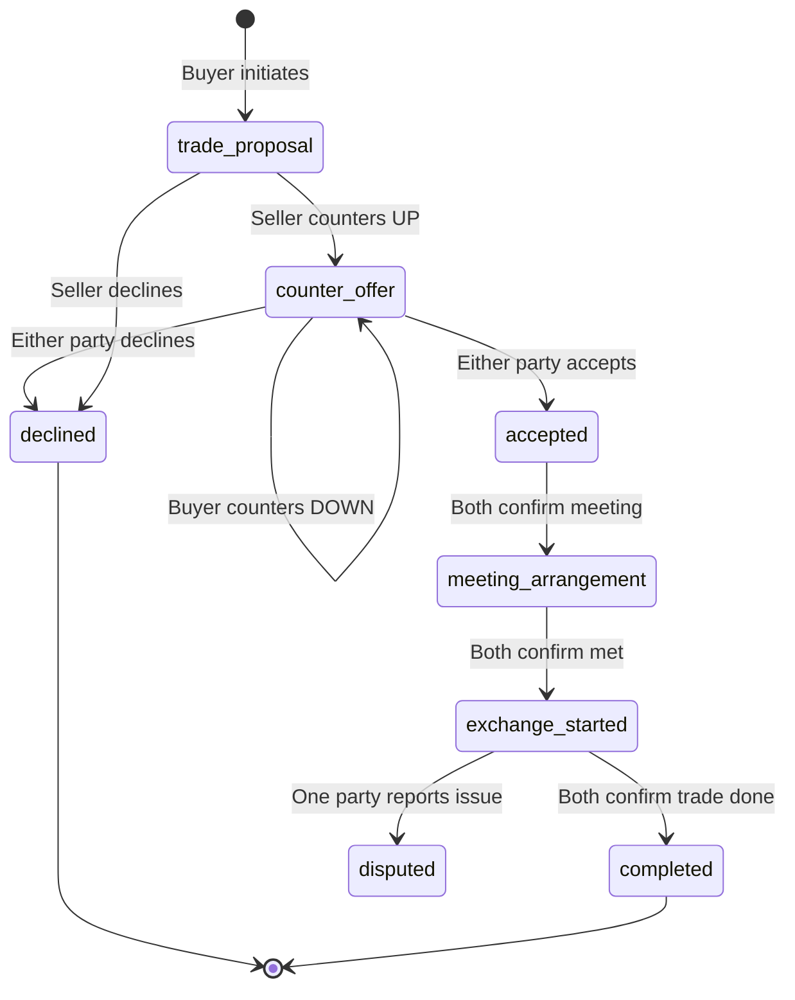

# Liwa — Peer-to-Peer Item Trading Platform

> A full-stack mobile marketplace where users trade physical items directly with each other through a swipe-based discovery system, real-time negotiation engine, and secure in-person exchange protocol.

**Built with:** React Native · Expo · Firebase · AI-assisted development (Kiro/Claude)

---

## Table of Contents

- [Overview](#overview)
- [Architecture](#architecture)
- [Database Schema](#database-schema)
- [Feature Breakdown](#feature-breakdown)
- [AI & Prompt Engineering Story](#ai--prompt-engineering-story)
- [Project Structure](#project-structure)
- [Key Technical Decisions](#key-technical-decisions)
- [Setup Guide](#setup-guide)

---

## Overview

Liwa solves a real problem in peer-to-peer trading: **trust, fairness, and logistics**. Most trading apps let users post items and chat freely, but have no structure around the negotiation or the actual exchange. Liwa enforces:

- A structured negotiation protocol (buyer/seller roles, counter-offer limits)
- Value-aware offers (detects when an item swap is unbalanced and suggests cash additions)
- A strict meeting agreement system (both parties must agree on exact time/location)
- A safety handoff protocol (QR verification at exchange)

---

## Architecture



### Data Flow — Making a Trade Offer



### Negotiation State Machine



---

## Database Schema

### `users`
```
{
  uid: string (Firebase Auth UID),
  name: string,
  email: string,
  location: string,
  profileImage: string (URL),
  trustScore: number (0-100),
  totalTrades: number,
  createdAt: timestamp
}
```

### `items`
```
{
  id: string,
  userId: string (owner),
  title: string,
  description: string,
  price: number (estimated value),
  category: string,
  condition: "new" | "like_new" | "good" | "fair",
  images: string[] (URLs),
  status: "available" | "pending" | "in_trade" | "completed" | "archived",
  isVisible: boolean,
  isActive: boolean,
  location: string,
  swipeRightCount: number,
  createdAt: timestamp
}
```

### `conversations`
```
{
  id: string,
  participants: string[] (two userIds),
  itemId: string (item being traded for),
  itemTitle: string,
  buyerId: string (person who initiated),
  sellerId: string (item owner),
  status: "active" | "completed" | "cancelled",
  lastMessage: string,
  lastMessageAt: timestamp,
  createdAt: timestamp
}
```

### `messages`
```
{
  id: string,
  conversationId: string,
  senderId: string,
  senderName: string,
  text: string,
  messageType: "text" | "trade_proposal" | "counter_offer" | "meeting_suggestion" | "meeting_confirmed" | "trade_step_confirmation" | "system",
  
  // For trade_proposal and counter_offer:
  cashAmount: number,
  offeredItems: [{ id, title, estimatedValue }],
  originalBuyerId: string,   // persists buyer identity through all rounds
  targetUserId: string,
  itemId: string,
  itemTitle: string,
  itemPrice: number,
  status: "pending" | "accepted" | "declined" | "countered",
  counterOfferRound: number,
  maxRounds: number,
  
  createdAt: timestamp
}
```

### `meetingSuggestions`
```
{
  id: string,
  conversationId: string,
  suggestedBy: string (userId),
  location: string,
  time: string,
  isPublicPlace: boolean,
  status: "suggested" | "confirmed" | "rejected",
  confirmedBy: string,
  confirmedAt: timestamp,
  gracePeriodMinutes: number (default: 15),
  strictAgreement: boolean,
  createdAt: timestamp
}
```

### `reviews`
```
{
  id: string,
  conversationId: string,
  reviewerId: string,
  revieweeId: string,
  rating: number (1-5),
  comment: string,
  isRevealed: boolean,   // blind review — only shown after both submit
  createdAt: timestamp
}
```

---

## Feature Breakdown

### 1. Swipe-Based Discovery
Users swipe through items listed by others. The discovery service filters out the user's own items, archived items, and items already in active trades. Results are cached for performance.

### 2. Smart Item Swap Valuation

When a user offers an item swap with no cash, the system:
1. Reads the estimated value of both items
2. Calculates the difference
3. Suggests cash additions to balance the trade
4. Clearly labels any cash as **"Additional Cash"** — not a replacement for the items

```
Example:
  Your item:    iPhone 12  →  $350
  Their item:   MacBook    →  $500
  Difference:              →  -$150

  System suggests:
  ✅ $150 (Exact Match)
  💙 $158 (Generous — 5% over)
  🟠 $135 (Conservative — 10% under)
```

### 3. Negotiation Role Enforcement

The system assigns roles at the start of a trade and enforces them throughout:

| Role | Assigned To | Rule |
|------|-------------|------|
| Buyer | Person who initiated the trade | Can only counter DOWN |
| Seller | Person who owns the item | Can only counter UP |

If a seller tries to counter with a lower amount, the app blocks it with an explanation. If a buyer tries to go higher, same thing.

### 4. Strict Meeting Agreement

Both parties must agree on the **exact same** location and time:
- System detects conflicting suggestions
- Blocks confirmation until conflict is resolved
- Auto-rejects other pending suggestions when one is confirmed
- Communicates 15-minute grace period to both parties

### 5. Item Lifecycle Management

Items move through defined stages with visual badges:

```
available → pending → in_trade → completed → archived
```

Items are locked during active trades to prevent double-trading.

### 6. Trade Security & QR Verification

At the point of physical exchange, both parties verify the trade using QR codes. This creates an audit trail and prevents disputes about whether the exchange happened.

### 7. Blind Review System

After a trade completes, both parties submit reviews independently. Reviews are only revealed after both have submitted — preventing bias from seeing the other person's review first.

---

## AI & Prompt Engineering Story

This project was built using **AI-assisted development** with Kiro (Claude-based IDE). Here's how specific complex problems were solved through prompt engineering:

---

### Problem 1: Negotiation Logic Was Backwards

**The Bug:** Both users were being told "You are a seller" and both could raise prices. A buyer offering $600 could receive a counter-offer of $300 from the seller — which makes no sense.

**The Root Cause:** The role detection was using `isOfferMaker` (did I send this message?) instead of tracking who initiated the original trade.

**The Prompt Approach:**
> "The first user who touched the trade item or made an offer is the buyer. The receiver is the seller. The seller should UP the price, the buyer should LOWER the price. The system needs to ensure both parties stay as buyer or seller to the end of completion."

**The Solution:** Store `originalBuyerId` in every message. For `trade_proposal`, `senderId` is always the buyer. For all subsequent `counter_offer` messages, check `originalBuyerId` to determine role — not who sent the current message.

```javascript
// Before (WRONG):
const userRole = isOfferMaker ? 'buyer' : 'seller';

// After (CORRECT):
if (offer.messageType === 'trade_proposal') {
  userRole = currentUserId === offer.senderId ? 'buyer' : 'seller';
} else {
  userRole = currentUserId === offer.originalBuyerId ? 'buyer' : 'seller';
}
```

---

### Problem 2: "Infinity%" Validation Error on Item Swaps

**The Bug:** When an item-for-item swap had `cashAmount = 0`, the percentage change validation calculated `(amount - 0) / 0 * 100 = Infinity%`, blocking all counter-offers.

**The Prompt Approach:**
> "For zero cash items but item on item exchange, the system needs to know that and add the amount. The amount is not a replacement of the item but an addition on the item value."

**The Solution:** Two-part fix:
1. Guard the percentage calculation: only run it when `currentAmount > 0`
2. Detect item exchanges separately and skip direction validation entirely — any positive cash addition is valid

```javascript
// Guard against division by zero
if (currentAmount > 0) {
  const percentageChange = Math.abs((amount - currentAmount) / currentAmount) * 100;
  if (percentageChange > 70) { /* block */ }
}

// Item exchanges: cash is additive, not directional
if (isItemExchange) {
  return { isValid: amount >= 0 };
}
```

---

### Problem 3: Meeting Conflict — System Assumed Agreement

**The Bug:** Two users could set completely different meeting times and locations, and the system would proceed as if they agreed.

**The Prompt Approach:**
> "Even though the users specified different times and locations, the system assumes it's no problem. We have to have a strict agreed-upon time and waiting time grace period."

**The Solution:** Built `checkMeetingConflicts()` that compares all pending suggestions per conversation. If two users have different pending suggestions, confirmation is blocked until one is withdrawn.

---

### Problem 4: Decline Modal Cut Off — No Submit Button Visible

**The Bug:** The decline reason modal was not scrollable. On small screens, the "Send Decline" button was hidden below the fold.

**The Prompt Approach:**
> "When declining the trade there is no button after the reason, the modal is not scrollable."

**The Solution:** Wrapped the reasons list in a `ScrollView` with `flex: 1`, and pinned the action buttons outside the scroll area with `borderTopWidth` separator — so they're always visible regardless of screen size.

---

### Prompt Engineering Patterns Used

| Pattern | Example |
|---------|---------|
| **Show, don't tell** | Shared screenshots of the broken UI instead of describing it |
| **Role-based framing** | "The first user who touched the trade is the buyer" — gave the AI a mental model |
| **Constraint specification** | "The seller should UP the price, the buyer should LOWER" — explicit rules |
| **Iterative refinement** | Each fix revealed the next layer of the problem; kept the context alive across sessions |
| **Context transfer** | Used structured summaries to resume sessions without losing state |

---

## Project Structure

```
liwa/
├── src/
│   ├── components/
│   │   ├── CounterOfferCard.js         # Offer card: accept / decline / counter
│   │   ├── LiwaCounterOfferModal.js    # Counter-offer input with role hints
│   │   ├── MeetingConfirmationCard.js  # Meeting agreement UI
│   │   ├── OfferOverviewCard.js        # Offer summary on item cards
│   │   ├── LifecycleBadge.js           # Item stage badge
│   │   ├── CounterOfferSuggestions.js  # Smart suggestion chips
│   │   └── ...
│   │
│   ├── screens/
│   │   ├── HomeScreen.js               # Feed with item cards
│   │   ├── SwipeScreen.js              # Tinder-style swipe discovery
│   │   ├── ChatScreen.js               # Trade conversation + offer cards
│   │   ├── MatchesScreen.js            # Active trade matches
│   │   ├── MyOffersScreen.js           # Sent/received offers
│   │   ├── MakeBetterOfferScreen.js    # Improved offer flow
│   │   ├── NotificationsScreen.js
│   │   └── ...
│   │
│   ├── services/
│   │   ├── OfferValueCalculator.js         # Value diff + cash suggestion engine
│   │   ├── MeetingConfirmationService.js   # Strict meeting agreement logic
│   │   ├── TradeSecurityService.js         # Fraud + security checks
│   │   ├── ItemLifecycleService.js         # Item stage transitions
│   │   ├── ItemLockingService.js           # Prevent double-trading
│   │   ├── CounterOfferTrackingService.js  # Round tracking
│   │   ├── MatchingService.js              # Swipe match logic
│   │   ├── TrustScoreService.js            # User reputation
│   │   └── ...
│   │
│   ├── context/
│   │   ├── AuthContext.js              # Firebase auth state
│   │   └── TradeContext.js             # Active trade state
│   │
│   └── config/
│       └── firebase.js                 # Firebase init
│
├── docs/
│   ├── negotiation-direction-validation.md
│   ├── item-swap-value-balancing.md
│   ├── strict-meeting-agreement.md
│   └── trade-completion-improvements.md
│
├── .gitignore
└── README.md
```

---

## Key Technical Decisions

### Why Firebase over a custom backend?
Real-time listeners (`onSnapshot`) make the chat and trade state updates instant without polling. For a two-person negotiation flow, this is critical — both users need to see changes the moment they happen.

### Why store `originalBuyerId` in every message?
Firestore has no joins. Each message needs to be self-contained enough to render correctly without fetching the original trade proposal. Denormalizing the buyer ID into every counter-offer message makes role detection O(1) instead of requiring a chain of document lookups.

### Why a state machine for trade lifecycle?
Trades have strict valid transitions (you can't go from `completed` back to `pending`). A state machine makes invalid transitions impossible at the service layer, not just the UI layer.

### Why blind reviews?
If User A sees User B gave them 5 stars before submitting their own review, they'll reciprocate. If they see 1 star, they'll retaliate. Blind reviews produce more honest feedback.

---

## Setup Guide

### Prerequisites
- Node.js 18+
- Expo CLI (`npm install -g expo-cli`)
- Expo Go app on your phone, or Android/iOS emulator

### Install

```bash
git clone https://github.com/YOUR_USERNAME/liwa.git
cd liwa
npm install
```

### Configure Firebase

Create a project at [console.firebase.google.com](https://console.firebase.google.com), enable Auth (Email/Password) and Firestore, then update `src/config/firebase.js` with your config.

> ⚠️ Keep your API keys out of public repos. Use a `.env` file for production.

### Run

```bash
npm start        # Expo dev server
npm run android  # Android emulator
npm run ios      # iOS simulator
```

---

## License

MIT
